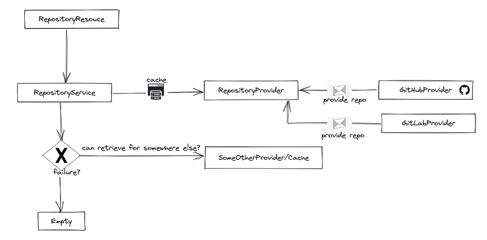

# Repository gateway, What is it?
This is a plain rest application implement using the [api-gateway-design-pattern](https://microservices.io/patterns/apigateway.html) , which behaves as gateway for public repositories such as git-hub, using this application is possible to get list of repositories from a provider filtering by language and creation time. 

The intention of this application is behave as proxy for providers being able to eventually switch between providers in case of failure.

## Prerequisites
* [java](https://yarnpkg.com/getting-started/install) (jdk version 18)
* [lombok](https://projectlombok.org/) reduce the boilerplate code, for installation in your idea please follow the [steps](https://www.baeldung.com/lombok-ide)

## Design
#### Patterns:
* [CircuitBreaker](https://martinfowler.com/bliki/CircuitBreaker.html) implemented with [Resilience4J](https://docs.spring.io/spring-cloud-circuitbreaker/docs/current/reference/html/#configuring-resilience4j-circuit-breakers)
* [Dependency Injection](https://en.wikipedia.org/wiki/Dependency_injection#:~:text=In%20software%20engineering%2C%20dependency%20injection,leading%20to%20loosely%20coupled%20programs.) implemented with [SpringFramework](https://spring.io/)

#### Layers:


Obs: This application uses in memory cache with caffeine for simple installation purpose, this is not desirable for production, in production is recommended to use a real cache tool such as redis/mongodb/Aerospike and so on.

## Installing dependencies
```bash
./gradlew build
```

## Tests and checks
To run all tests:
```bash
./gradlew test
```

## Run locally
To start the service locally at http://localhost:8080/swagger-ui/index.html#/
```bash
./gradlew bootRun
```

## How to interact with it:
For better demonstration purposes, this project contains swagger

After run the project, please open your browser and access  http://localhost:8080/swagger-ui/index.html#/ you will be able to see and interact with the application.

## Metrics:
Metrics are exported at http://localhost:8081/actuator, apart from the default metrics the project also export.

| Metric   				                                                                                                | Description    							|
|--------------------------------------------------------------------------------------------------------------------------|--------------------------------------------|
| [repository_fallback_metric](http://localhost:8081/actuator/metrics/repository_fallback_metric)                          | Amount of errors as fallback 	             | 
| [findAllPublicRepositoriesFallBack](http://localhost:8081/actuator/circuitbreakerevents/findAllPublicRepositoriesFallBack)	| Show status of circuit  	                  |

## Resources:
###### Fetch repositories with no filter 
```bash
curl -X 'GET' 'http://localhost:8080/v1/repositories' -H 'accept: */*'
```

###### Fetch repositories filtering by language
```bash
curl -X 'GET' 'http://localhost:8080/v1/repositories?language=java' -H 'accept: */*'
```

###### Fetch repositories filtering by creation time
```bash
curl -X 'GET' 'http://localhost:8080/v1/repositories?createdOn=2020-01-10' -H 'accept: */*'
```

###### Fetch repositories filtering by creation time/language
```bash
curl -X 'GET' 'http://localhost:8080/v1/repositories?language=java&createdOn=2020-01-10' -H 'accept: */*'
```
